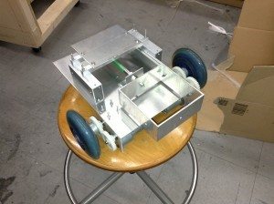
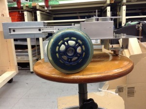
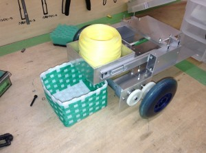
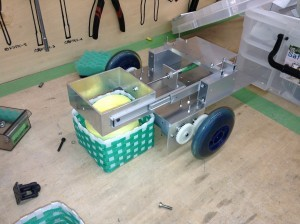

こんばんは．　きゅーぶです．  
　今回は先週記事で取りあげた部内ロボコンに出す手動機を紹介します． ・・・といってもまだ自分のチームの機体はまだ完成していない（あとちょっとです！）ので先にもう一方のチームが作った手動機を紹介したいと思います．  
 

全体図　　　　　　　　　　　　　　　　　　　　　　横から見た図 エアシリンダーのガイドとしてスライドレールを使っています  
　モーターはお互いのチームに与えられているタミヤ380モーター，タイヤは市販のキックボードについているものを使用しています．

  

荷物（筒）を箱に入れる図　　　（大会で使う筒がなかったので直径がほぼ同じテープで代用しています）  
　このチームの手動機は自動機から受け取った荷物（筒）を箱に入れるのにエアシリンダーを使って押し出すことで入れます．しかしただ押し出すだけではエアシリンダーが伸びる勢いが強すぎて箱を超えてフィールド外に出でしまうかもしれません．なので100×100mmの角パイプを囲いとして使って角パイプの中に筒を入れ，その角パイプをエアシリンダーで動かすことによって飛び出さずに箱へ入れることができるのです．  
　まだこの機体に基盤やバッテリーなどを積んでないのですがチームの制御担当者によると近々配線をして操作練習ができるようにするらしいです．こっちのチームも負けてられません！  
　来週は自分のチームの手動機紹介をする予定です．お楽しみに．  
それでは今日はここで，失礼します．
