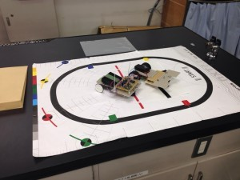

こんにちは。ふじきです。  
11/8、9に開催された「青少年のための科学の祭典　京都大会」に当プロジェクトも参加しました。  
科学の祭典とは理工系分野の実験、工作を展示して来場者に科学の面白さを知ってもらうイベントです。 青少年のためと書かれていますが年齢層は広く様々な人が訪れます。 当プロジェクトも毎年割り当てられたブースでプロジェクトの宣伝も兼ねたロボットの実演を行っています。  
今年の科学の祭典では当プロジェクトはパラレルリンクロボットとライントレーサーを子供たちの前で披露しました。 

パラレルリンクロボットはパラレルメカニズムという機構を用いたロボットのことで産業用ロボットとして使われています。 今回の目玉として数か月前から準備してきただけあって多くの人に関心を持たれたようです。 2日間にわたり1回生を含めた当プロジェクトのメンバーで来場者の対応を行い、ロボットの仕組みを子供たちに説明しました。   
例年に比べると今年はかなり力を入れたと思うのでこれをきっかけにロボットに興味を持ってくれる子供たちが増えると嬉しいです。
