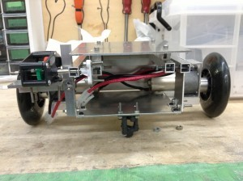

こんばんは．きゅーぶです．  

　今回も前回から引き続き部内ロボコンについて紹介したいと思います．  

　今日紹介するのは自分のチームの荷物を運搬する手動機です． 

図：手動機　　　一番上に天板（後述）がついています　　　　　　　横から見た図．ボールキャスターが前についています

 

 

正面から見た図．左側にミニモーターがあります．配線はまだです．  

　タイヤとモーターは先週紹介した相手チームの手動機と同様にキックボードから取り外したタイヤとタミヤ380モーターを使っています．       

荷物を箱の位置まで運搬したら　　　　　　　　　　　　　　　　　　モーターを動かしてすべり落とします

 

 

　運搬した荷物を箱に入れる方法ですが自分のチームはまず荷物を機体一番上にある板（天板）に乗せます．荷物を箱の前まで運んだあと，天板と連動させてあるミニモーターを動かし天板を傾けます．そして傾けられた天板の上にある荷物は天板からすべりおちて箱へ落ちて入るというものです．   　箱へ入る筒の向きがほぼ垂直になるのでそのまま入れるより入れられる範囲が広いのが特徴です． 　ただタイヤとボールキャスターの距離が短すぎるのと重心がタイヤに寄りすぎていたので試運転をしたら仰向けになりかけることが多々あったので後で仰向けにならないよう改良を施すつもりです．

 

　気づけば大会まであと3週間．頑張っていきます．

 

それでは今日はここで，失礼します．
