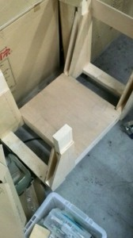

こんにちは。ふじきです。  
今年のNHKロボコンに向けた練習のためのフィールド設営が思ったより難航しています。  
というのもロボットを動かす際に床を傷つけないよう重量物の荷重や動荷重に強いロンリウムと呼ばれるビニル床シート(NHKロボコン本番のフィールドにも敷かれています)を敷く必要があるのですが、これがとても重く数が多いためフィールド設営には毎回多くのメンバーが必要になります。  しかし大学のカリキュラムの都合上、後期に入ってから体育館や部屋を借りられる昼間は2回生組は授業があるため殆ど参加できない上、今年から大学の方針が変わり3回生は研究室に配属されるため時間が取れなくなってしまい、結果的に出来上がったロボットや試作機構の動作確認は辛うじて人が集まる週末にまとめてやることになっています。  
そこで少しでも設営時の負担を減らし効率を高めるため当プロジェクトはロンリウムを運ぶための自作台車を作ることにしました。  この台車は1回生が作ってくれたものでさっそく先週の日曜日に活用してみましたが、一度にたくさんのロンリウムを運べるため部室と部屋を行き来する必要がなくなり、設営時の労力をかなり減らすことができました。  
以前にも似たようなことを言いましたが、今年はロボットのことだけでなくいかに効率よくフィールドを設営し練習時間を確保できるかにかかっていると思います。  
それでは今日はここで失礼します。
