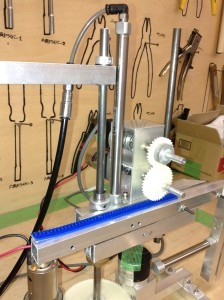

こんばんは。きゅーぶです。

 

今回は自分のチームの自動機について紹介したいと思います。

自動機全体図　　　　　　　　　　　　　　　　　　　　　　　　　青い部分がラックでハンドを伸ばすときに使います

 

真ん中の棒が一番下にある大きな歯車によって回転する軸棒でその棒に固定されているハンド部分を回転させます。

ハンドを下から見た図　　金色の固定部品で棒と下側の角パイプを固定します

 

ハンド部分拡大図　　　　　　　　　　　　　　　エアシリンダーが伸びてハンド部分が上昇します

機構上、軸棒とエアシリンダーだけでは回転したときエアシリンダーに横からの力がかかってしまい危ないので右端に棒をもう一本つけることでエアシリンダーが伸びるガイドの役割と同時に横方向への負荷がかからないようにしています。上下するハンド部分と棒の間にリニアブッシュをつけて上下がなめらかにできるようにしています。

 

この自動機が荷物を手動機にのせる流れとしましては

・開始後真ん中にあるエアシリンダーでハンド部分が上昇する

↓

・一番下の大きな歯車を回転させることで棒と固定してあるハンド部分を筒のある方向まで回す

↓

・ハンドについているラックを歯車で動かすことでハンド先を筒のある位置まで伸ばす

↓

・エアシリンダーを縮めてハンド先を筒の中に入れる

↓

・ハンド先に取り付けてあるエアシリンダーを使って筒を内側から把持する

↓

 

・エアシリンダーを持ち上げ回転させ手動機の位置まで筒を運ぶ

↓

・手動機の位置まで来たらハンド先のエアシリンダーを縮めて筒を手動機の上にのせる

というものです。

軸の回転とラックによる伸ばしはエンコーダーで制御し、一連の作業を10秒弱でする予定です。

 

全体的に簡単な機構ですが案を練って設計をするとき考えすぎて完成するのに大分時間がかかってしまいました。

 

お互いのチームのソフト班、ハード班の進捗があまり芳しくないので部内ロボコンの開催を一週間ほど延期することになりそうとのことです。申し訳ない限りです。

 

延期する分、機体の完成度をあげるように先輩からプレッシャーをかけられたのでちゃんと予定通りの動きをするように調整に調整を加えているところです。頑張っていきます。

 

それでは、今日はここで。失礼します。
