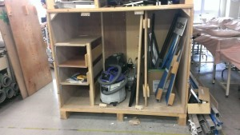

こんばんは。きゅーぶです。

 

今回も部内ロボコンのことを紹介しようと相手チームの機体を紹介しようと思ったのですが調整に忙しく写真を撮影させてもらえなかったので他のことを紹介したいと思います。

 

 

昨年からだったのですが現在部室の入口は狭く、NHKで使う機体や広報用の機体を部室から出し入れするのに大変難儀していました。

なので今回部室の入口を広くすることにしました。

拡張前の部室入口　　　　　　　　　　　　　　　　　　　　　　　　拡張後

 

拡張前の写真を撮るのを忘れていたので以前大掃除の時に撮影した写真を使用してます。

 

拡張前は木の棚（元々NHKロボットの運搬用の木箱）が手前でその裏に部品などが入っている棚があったのですがそれを90度回転させることで床タイル一列分（約30㎝）拡張しました。木箱が重く、動かすのが大変でしたがおかげで機体の持ち運びが楽になりました。

 

それでは、今日ははここで。失礼します。
