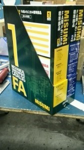

こんにちは。ふじきです。  
今年も当プロジェクトは株式会社ミスミ様のミスミ学生ものつくり支援に応募し支援を受けさせてもらえることになりました。 支援の内容は1団体毎に製作する機械向けのメカニカル部品や配線部品、制御部品から5万円分の商品を提供してもらえます。 品質のいいミスミ製品を無償で提供してもらえるということで毎年当プロジェクトも応募させてもらっています。  
 新しいミスミのカタログです(相変わらず分厚い…そして重い)  
ミスミ製品は精度が高くこれまで使ってきた経験則から鑑みても信頼性が高いです。 NHKロボコンに限らず後々、使いまわしが効くような部品を購入しようと考え、メンバーから意見を募っているところです。
