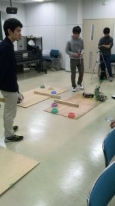
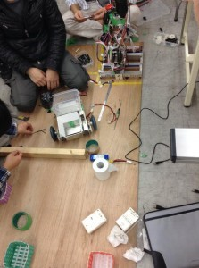

こんばんは。きゅーぶです。

 

先日、以前からお伝えしていた部内ロボコンがついに開催されました。

 

 

一回生がSiチームとSaチームの２チームにわかれてこの二ヶ月切磋琢磨しながらロボット製作に励みました。（自分はSaチームです）

 

大会では２チームが接戦を繰り広げる・・・・はずだったのですがSiチームの自動機が本番直前に動かなくなってしまいました。調べたところモータードライバ基盤が壊れていて急いで取り替えましたが大会まで調整が間に合いませんでした・・・。機体の設計が遅れ、制御する時間が短い中、制御担当の子が必死に作業していたのをずっと見ていたので動かないのは相手チームでしたが悔しかったです。

 

Saチームの機体は動いたので本番に動かしました。２つ目のワークまでは順調に自動機が手動機にのせ、手動機が箱まで運搬、投入しましたが最後のゴールデン小包がなかなか掴めず時間切れとなってしまいました。後で調べたところゴールデン小包だけたまたま当初予定されていた養生テープの筒ではなくほんの少し低かったので掴めな方ということが判明しました。多少高さが低くなっても取れるような設計にしなかったのは反省すべき点です。

 

 

 

調整中のSiチーム

 

 

今回の部内を通して反省すべき点が多く見つかりました。スケジュールの管理や機体設計の仕方、加工や組立方法などのハード分野における改善点。更にソフト面においても制御の方法や配線などまだまだ直すべきところがたくさんあるということがわかりました。来年以降NHKロボコンで主戦力となっていけるように頑張っていきます。

大会では動かなかったSiチームの自動機ですがまだ紹介ができていないというのもあるので近々ちゃんと動くように調整した姿をブログ内で紹介したいと思います。

 

それでは、今日はここで。失礼します。
