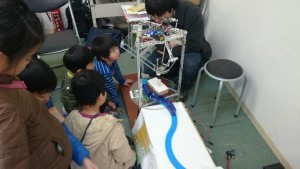

こんばんは、きゅーぶです。

 

紹介が遅れてしまいましたが２０１5年１月３、４日に「ちびっこ科学体験教室」に参加しました。

 

「ちびっこ科学体験教室」は、南海電気鉄道様、NPO法人の ZOO CAN DREAM PROJECT様と京都工芸繊維大学が連携し、大阪府泉南郡のみさき公園で昨年度から開催している催しで子供達に科学の様々な分野に触れる体験をして欲しいという目的で行われています。昨年に引き続き今年も私たちプロジェクトはブースを出展しました。

 

今回の展示テーマは「みさき公園ロボットコンテスト」というもので、ゲーム用コントローラを用いて「パラレルリンクロボット」を実際に操作体験してもらいました。これは以前ブログでも紹介した青少年の科学の祭典に出展した時に展示したのと同じものです。2日間を通して、多くのお子さんにロボットを動かす面白さを感じてもらえました。

 

独特な動きをするパラレルリンクロボットに子供達が釘付けになっていました

 

 

今年も積極的に各種イベントへ参加していきたいと思います。

 

それでは、今日はここで。失礼します。
