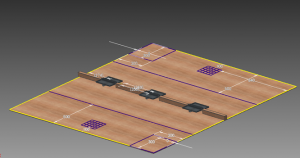

こんにちは。ふじきです。  
新入生を迎える前に新しく入部してくれたメンバーとの親睦を深めるため去年行ったミニロボコンを開催することになりました。 競技内容はシーソーの台にワークを乗せてより多くのシーソーを自分の側へ傾けさせた方が勝ちのシンプルな対戦形式となっています。 最近は(仕方がないとはいえ)NHKの作業ばかりで加工しかやっていないメンバーもいるので、簡単なものとはいえロボット作りの楽しさをもう一度思い出すいい機会になればいいなと思います。  
