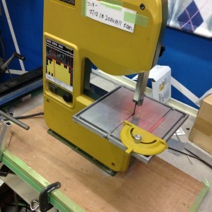

こんばんは。きゅーぶです。

 

先日部室のコンターの下に台を取り付けました。

 

 

 

コンターでの作業をする際倒れやすくて危ないということで木の板に穴を開けねじで固定して倒れないようにしました。

 

NHKロボコンの加工作業が多いので仕方ないですが最近よく刃が切れるので注意書きを貼っています。安いとは言えない値段なのでなるべく切らないよう焦らず丁寧に作業します。

 

それでは、今日はここで。失礼します。
