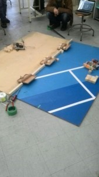

こんにちは。ふじきです。  
前回予告した通り、新しく入ってきたメンバーとの交流も兼ねて部内ミニロボコンを開催しました。 タミヤのキットなどを改造した簡単なロボットでワーク(木のブロック)を運んでシーソーに乗せるという単純なものではありますが、なかなかに白熱した内容となりメンバー間の親睦を深めるいい機会となったのではないかと思います。 (自分も参加しましたが準備不足のため残念ながら惨敗です…)   このミニロボコンは今年の5月頭ぐらいにも実施する予定で入ってきたばかりの新1回生たちに上回生との交流も兼ねつつロボット作りの楽しさに触れてもらおうと考えています。
