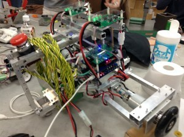

こんばんは。きゅーぶです。

 

 

先日ソフト班の人からPID制御を練習するようの練習機体を作ってくれないかと頼まれたので一回生の子が制作しました。

 

製作した機体。エンコーダーとモーターが幅を取るので横長になってます。

 

PID制御とは、

**””PID制御**（ピーアイディーせいぎょ、Proportional-Integral-Derivative Controller、PID Controller）は、[制御工学](http://ja.wikipedia.org/wiki/%E5%88%B6%E5%BE%A1%E5%B7%A5%E5%AD%A6 "制御工学")における[フィードバック](http://ja.wikipedia.org/wiki/%E3%83%95%E3%82%A3%E3%83%BC%E3%83%89%E3%83%90%E3%83%83%E3%82%AF "フィードバック")制御の一種であり、入力値の制御を出力値と目標値との偏差、その[積分](http://ja.wikipedia.org/wiki/%E7%A9%8D%E5%88%86 "積分")、および[微分](http://ja.wikipedia.org/wiki/%E5%BE%AE%E5%88%86 "微分")の3つの要素によって行う方法のことである””（引用：wikipedia『PID制御』　http://ja.wikipedia.org/wiki/PID%E5%88%B6%E5%BE%A1）

 

という・・・・・・・・・・・・・つまりざっくり言うと車が目標速度に到達するまで上手にアクセルを踏む量を変えるのと同じようにロボットの加速度を調整してヌルヌル動くようにする制御方法です（私も詳しくないのでもっと知りたい方は各自ググってください）

 

急にタイヤが回ってロンリウムをゴリゴリ削りながら動かずヌルヌル動くとモーターのパフォーマンスが十二分に発揮されるので非常に重要です。

 

製作した子曰くいい感じに噛み合うエンコーダーとモーターの間のカップリングひと組が見つからなかったらしく穴をずらしたりするのがめんどかったそうなので今回だけでなく後々の後輩が学ぶために使われて欲しいとのことでした。

 

 

それでは、今日はここで。失礼します。
