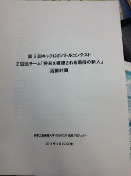

こんにちは。きゅーぶです。

 

私達新二回生は来る９月に開催される株式会社京都製作所様主催のキャチロボバトルコンテスト（[http://catchrobo.net/index.html](http://catchrobo.net/index.html)）に出場し優勝するために現在アイデア出しを行っています。

チーム名（仮）は新二回生の一人が考えました。インパクトがすごいです。

 

昨年の大会で一回生だった我々は二回戦で手も足も出ず敗退という悔しい思いをしたのでそのリベンジに燃えています。

 

昨年の失敗を振り返り、勝てる機体を作るにはどれにどれだけ時間を割けばいいのかをチームで話し合い細かなスケジュールを作成しました。

 

チームでアイデア出しを複数行ったのでこれから約１か月各自が設計に取り組み、できたものをプレゼン形式でアピールバトルをしてチームで作る機体を決めることとなります。

 

 

プレゼンバトルで勝って自分の機体で優勝する所存です！！・・・・・・・・部内ロボコンの時等でわかったのですが私は特に設計が遅いので今回はそんなことがないように頑張っていきたいです。

 

それでは、今日はここで。失礼します。
