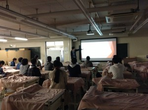

こんばんは。きゅーぶです。

 

先日ロボコンに興味がある新入生達に向けてプロジェクト活動の説明会を行いました。

 

座っているのは全員新入生!多い！！嬉しい！！

 

プロジェクトリーダーがロボコン挑戦プロジェクトがどのようなものであるかや過去の実績等を説明しました。またその後製作中の機体や作業風景を見せながらどのようなものを作っていくのかの説明もしました。

 

当日は予想よりも多くの新入生が部室に集まってくれて応対にてんやわんやしてました。嬉しい悲鳴でなによりです。

 

去年の新入部員（僕の世代です）が６人と少なく今年も危ないのではという不安があったので沢山入ってくれそうで部員一同ホっとしています。

 

既に積極的に活動を始めている新入部員もいるので未来は明るそうです。本当によかったです。

 

一応予定としては今週の金曜までをとりあえず入部の募集期間としてその後一回生教育を始めて行こうかと思っています。もちろん金曜を過ぎても入部は大歓迎です、お待ちしております。

 

 

そ！れ！と！もう一つお知らせなのですが先日のNHKロボコン公式サイトに本戦出場校一覧が出されてチームForteFibreは**シード校に選ばれました！！**

 

20校の中のさらに８チーム、二年連続シード入りはチームの実力が年々確かについていることを実感します。

残り二ヶ月頑張っていきたいと思います！！

 

それでは、今日はここで。失礼します。
