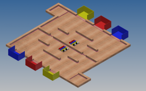

こんにちは。ふじきです。  
新入生説明会から約1週間が経過し、現時点で20名以上の新入生が入部してくれることになりました。 こちらの予想をはるかに上回る入部者の数に嬉しい反面、新入生の対応が追い付かなくなってしまい申し訳ない限りです。  
さて今年の新1回生にはこの1年間を通して3回の新人戦を行うことで次のNHKロボコンに向けての実力を磨いてもらう計画でありますが、その第1回目を今月の29日に行おうと考えています。  
入部して早々であるため競技の内容は簡単なものとなっており、色の付いた玉を同じ色のゴールゾーンへ運ぶというシンプルなものです。  これを機に新入生同士や上回生との交流を持つきっかけになればいいなと思います。
