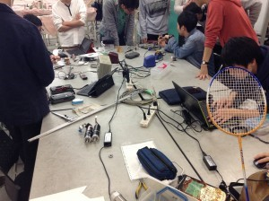

こんばんは。きゅーぶです。

 

４月も後半になってきたので入ってきた新入生に向けて勉強会を開いています。

 

ソフト班の勉強会風景。ハンダ付けの仕方を教えています。

 

ソフト班は抵抗値の読み方や回路の作り方、ハード班は設計に使うCADソフトの使い方等それぞれの基礎的な事項を教えています。

 

今年はなんと最終的に**２６人**も新入生が入ってきてとても驚いています。

 

僕の入った去年の新入生が最初６人だったのでなんと４倍以上！！（・・・・・なんで去年少なかったんやという思いも去年の苦労とともにわいてきます）現二、三回生を合わせても２４人なので尋常じゃないくらい多いです。ミーティングをすると部室の机が全部埋まります。圧巻です。

 

先日のふじき先輩の記事にもあったように新入生にはまず新人戦を行ってもらって、

 

ロボットとはどうやって動くのか、

 

勝つためにどうすればいいか、

 

（去年の僕みたいにいいアイデアを思いついてもそれが如何に思い通りにできず実装するまで遠いか）

 

を学んでもらう予定だったのですが予想以上の多さで急遽発注したキットを足しても足りないという事態になってしまったので開催を延期することとなりました。てんやわんやです。

 

新しいアイデアや技術は一人だけではなかなかできないもの。活動する仲間と話すことでお互い伸びたことが一年通して印象に残っています。

 

新入生には数が多い分同期や先輩との交流を通してメキメキグングン成長して欲しいものです。

 

それでは、今日はここで。失礼します。
