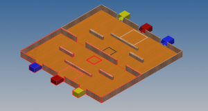

こんにちは。ふじきです。  
予想を上回る入部者の多さに開催が延期されていた新人戦でしたが、ようやく開催日が決まり5/9にとり行うことになりました。  
新入生には1人ずつ工作キットを渡してそれを自分なりに改良して出場してもらう予定でしたが、流石に新入生**28人**分のキットをそろえるのは大変なもので2人1組のチームを作って競ってもらうことになりました。 この新人戦を行う理由として新入生同士の交流を促進させることもあるので本来の目的に沿っているとは思います。 またそれに合わせて若干、競技の難易度を引き上げました。 このGWを目一杯使って相方と一緒に試行錯誤しながら優勝目指して頑張ってもらいたいと思います。 
