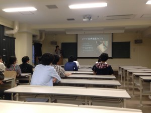

こんばんは。きゅーぶです。

 

５月に入りましたがみなさんGWはどのようにお過ごしだったでしょうか？僕はずっと加工してました。ええしてましたとも。

 

ほんとはGW中にできた、部の加工力の飛躍を感じるパーツ（僕が作ったとは言ってない）をドヤ顔で語りたいんですがNHK関連のことなんでまだ書けないんですね。大会終わったら書きたいと思います。

 

さて、GWはNHK作業の傍ら新入生の勉強会も次の段階へ移行してました。

 

 

T先輩直々に教えていただけるソフトの勉強会。センサーの種類について。

 

 

 

K先輩による非常にためになるハードの勉強会。2Dスケッチは大事ですね。ほんと。

 

こないだからの勉強会で基礎を習得したということでソフトはプログラミング言語の勉強会、ハードは設計についての勉強会をし始めました。

 

ソフトはC言語、ハードはハンドの設計をやるとかなんとか。

 

自分は去年の今頃にリンク機構とか慣性モーメントを初めて知ったとき世の中すごいものがあるんだなぁ・・・という感じで理解するのにあっぷあっぷしてた思い出があるんですが今の新入生達もそんな感じなんでしょうかね？

 

複雑なリンクは一朝一夕で思いつくものでもないですし、まず知識なり経験なり蓄えないと設計するとき思い出せないんで新入生たちにはぜひ動画をあさって積極的に学んでいってほしいですね。

 

NHKまで一ヶ月切ってるのでできる限りのことをしていく所存です。

 

それでは、今日はここで。失礼します。
