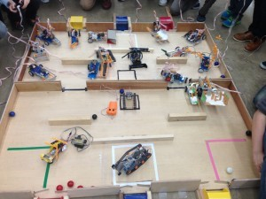
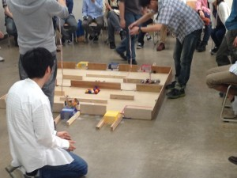

こんにちは。ふじきです 新入生教育プログラムの一貫である第1回新人戦を5/9(土)に開催しました。   
本来なら4月中に行う予定でしたが、こちらの予想をはるかに上回る1回生の数に対応が追いつかず延期という結果になりましたが、無事執り行うことができてよかったです。  
年3回行う予定の新人戦の1回目は工作キットを用いた簡単な競技を行ってもらい、入ったばかりの新入生同士の交流を深める狙いがありましたが、今回の結果を見る限りなかなかうまくいったかなと思います。   
正直今回のルールは少し難しすぎたかなと自分でも少し反省していたのですが、2人1組でペアを組んで各々様々な工夫を凝らしたロボットで競技に望んでもらいルールを作った側としては喜ばしい限りです。  
逆に1回生に年の功を見せ付けようとしていた何名かの上回生は試合当日で機体を用意すればいいと余裕の態度でいたら散々な結果になりました。 ある意味でいい反面教師となった気がしなくもありません。  
 1回生は今後正式にソフト班、ハード班に分かれてそれぞれ与えられる課題をこなしながら次の第2回新人戦に備えてもらいます。 この大会で培ったつながりを無くさないまま一丸となってこの1年を乗り越えてほしいと切に願います。
