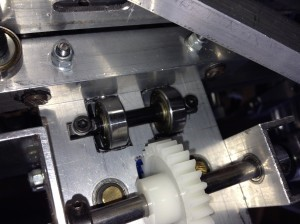
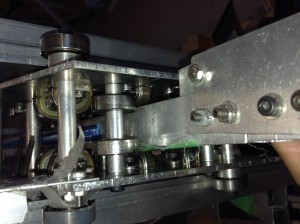
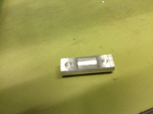
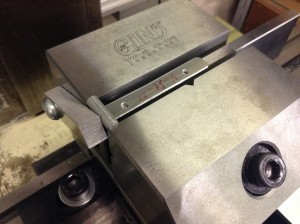
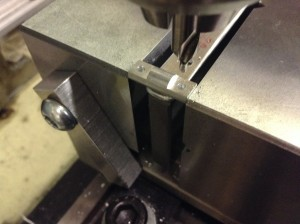
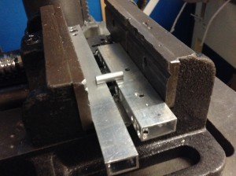
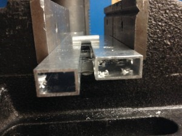

こんにちは．きゅーぶです．

 

更新が大分滞ってしまいました申し訳ございません。その分今日はちょっと長いです。

 

現在二回生が出場するキャチロボの大会の為に一号機を制作中なのですがその際ベアリングシャフトを初めて作りました．

その時気づいたこともろもろを書いていきたいと思います．

 

今回作るのは角パイプを直動させるために板に貼る用のベアリングシャフトです．

角パイプを通すために板に穴をあけてベアリングをつけるようなシャフトを作ります（画像はイメージです）

↑完成品

 

長い直動を支えるのに便利なのでうちの部活ではちょくちょく使っています。

 

ベアリングシャフトは板に付けるので板とシャフトの接面は平坦でなければなりません．なので旋盤で長さと端面を出してからフライス加工をします．

 

ベアリングシャフトにおける製作過程は以下のようになります．

 

1.材料から切り出し，長さと端面出し（旋盤）

2.フライスのバイスに取り付けゼロ点合わせ

3.エンドミルで片端を荒削り，もう片端も同様に

4.最後に削る時だけ両端を同時に削る（両端で高さが揃う）

5.もみつけ

6.ドリルで穴を開ける

 

これでやっと一個・・・・・・・・2,3と4,5の間に工具付け替えもあるんで時間がかかり非常に面倒・・・・・・・．

 

 

**機体設計者くん「あ，この機体ベアリングシャフト18個必要やし．がんばって★」**

 

**僕「へあっ！！****？」**

 

 

えらいことをさらっと言われたのですがしかたありません．二回生機体の設計プレゼンバトルで負けた僕が悪いのです．

 

というわけで18個も作るんだからもう少し早くできる方法がないかを先輩からアドバイスをもらいつつ考えました.

 

 

・ゼロ点合わせ

ワークを正直台の上に乗せて固定。間違ってバイスをゴリゴリしないために適当に板を挟んで高さ上げしてます。

シャフトの軸方向を掴んでいるのは端面がでているからと、バイスをゴリゴリしたくないから直径がバイスから出るまで高さを上げたいからです。

 

ワークをバイスに挟む時、板をバイスの横面にあてて、そこにワークをあてながら挟めばx方向のゼロ点が毎回（大体）一定にできます．このバイスには横にねじ穴があったのでブロック材に穴をあけたものを軽く固定してます．

 

ｙ方向はバイスの挟む面を基準にできるので一定にできる。

 

z方向も挟む際ワークをしっかりハンマーで叩いて正直台からの高さを一定にすれば一番最初に加工するときゼロ点を出せば二個目以降はわざわざやらなくて済む。

 

といった感じにすることでゼロ点合わせを毎回行わずにすることができました。

これでゼロ点を合わせる時間だけでなくエンドミルと芯出しバーを付け替える時間も削減することに成功しました。

 

 

・もみつけ

 

画像貼っといて言うのもなんですが結論から言うともみつけはしないことにしました。

 

これは

 

・いくらこっちで精度出しても付ける板の方の穴はボール盤で空けるから精度なんてでない

 

・精度なくて多少ズレてもベアリングは動かす角パイプの端っこギリギリにつけてるわけでもないから余裕で当たるし回るし、穴を大きくすれば取り付け時に十分修正できる。

 

（・もみつけするためにエンドミルをセンタードリルに付け替えないといけず、前述のz軸方向のゼロ点を二個目以降もまた出さないといけないからめんどい）

 

という理由でしないことにしました。ここでもドリルの付け替え等でかかる時間を削減できるので大幅に時間を短縮できました。

 

 

・ドリルで穴あけ

 

最後の穴あけです。穴の大きさは精度が悪くても取り付けしやすいように3.3ぐらいで空けます（板の穴も同じ大きさ）

 

ただシャフトと穴が直角でなければせっかく出した平面が板にぴったりつかず生かされません。なので挟む時に工夫しました。

 

 

 

シャフトのフライスで出した平面を適当に高さの同じ板やパイプに当て、それをバイスに挟むことでボール盤のドリルがシャフトの平面と直角になるようにしました。

挟む力を強くしすぎるとシャフトが浮いてしまうので注意します。

 

と、このようにすることでフライス作業の2~5は一番初めに２さえやれば3、4だけで終わります。

ついでに言うともみつけもしないので（ほぼなかったですが）x軸のゼロ点合わせもいりません。

 

 

この短縮法を使えばフライス作業が一個40分くらいかかっていたのが4、5分程度で終わります。速度は１０倍。すごい。

18個作るのに計算上12時間かかっていたのが１時間ちょっとで終わります。ものすごい。

 

 

他の作業も比較的楽にできる（旋盤は担当じゃないんで知らないです。設計者くんが旋盤使いなのでせいぜい苦しめばいいと思います）のでベアリングシャフト製作は従来より格段に早くなったと思います。よかことです。

 

 

といった感じにフライス作業の高速化を模索してました。今回は結局使いませんでしたがx軸方向のゼロ点合わせは他の機会に役立ちそうなので発見できてよかったです。

 

 

それでは。今日はここで。失礼します。
