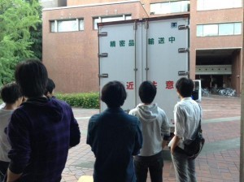
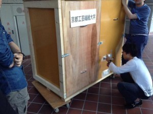

こんばんは。きゅーぶです。

 

大会前から僕の担当日（毎週金土日のいずれか）に更新できなかったのでお久しぶりというわけなのですが若干言い訳させてください。

 

ほんとだったら大会直前ということで土曜に「明日はいよいよ大会です！」ってタイトルで頑張ります！って記事書いて深夜バスで東京に向かいたかったんですが、土曜に起きたら東京のピットメンバーから連絡来て

 

「部室に忘れもんあるから持ってきてくれ」

 

「うぃっす」

 

の二つ返事でその日のうちに東京行ったんでチームのために走った僕は更新できなかったわけですねはい金曜にしとけばよかったです。非常事態だったので許してください。

 

なんかあった時のためにある程度記事を書き溜めるべきかもしれません（できるとは・・・

 

今年の反省にもあがってましたが来年は忘れ物ないように持ってくものリストをちゃんと全員で確認して忘れ物がないようにしたいですね。ってことを忘れないようにしたいですねほんと。

 

 

ブログに載せる予定だった写真の一部。[公式SNS](https://twitter.com/kitrobocon)の方にもあげたやつですが機体のお見送りして部室が寂しくなりましたって写真もつけてかさ増し詳しくお伝えしたかった・・・・

 

NHKの裏話はチームメンバーに聞いてから書くと思います。少々お待ちを～

 

・・・という具合にかさ増し言い訳も終わったので本題に入ります。

 

先週から一回生に工場加工を教え始めました。うちのロボコンでは特に精度が必要だったりでかい加工をするとき学校の工場（正式名称はたしか「ものづくり教育支援センター」です）を使わせてもらってますがそこでの加工の仕方を一回生に教えてました。

 

今回は旋盤、フライス、それと工場のでかいコンターと電ノコの使い方を教えてました

 

旋盤はふじき先輩達旋盤班の担当で僕はフライスを教えてました。

 

ただ教える時間の都合上授業1コマ分（１時間半）の間に教えないといけなかったので

・部材の切り出し（電ノコ、コンター）

・端面出し

・ゼロ点合わせ

・もみつけ

の本当に初歩的なことしか解説しきれませんでした。一年生にはせめてフライスは作業が多いけど頑張ったら精度いいものができるんだなぁということがわかって欲しい・・・・

 

もちろん今回だけであとは一人でいけ！って行ってもまぁ無理というか危なくて行かせられないので最初の何回かはついていきながら加工ということになりそうです。

 

去年僕の時は夏休みくらいに教えてもらったあと全然図面が振られず結局１２月くらいの部内ロボコンでフライスやるぞ！ってなっても方法を忘れてて先輩にそこそこ教え直してもらってたので今年は簡単なものでもいいのでとりあえず工場加工に慣れてやり方を覚えてほしいですね。

 

 

それでは、今日はここで。失礼します。
