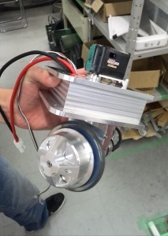
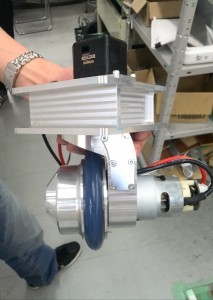

こんにちは。ふじきです。  
突然ですが、今年のNHKは去年のNHKで優勝した名古屋工業大学さんのロボットの足回りを参考に4輪ステアリングの足回りを使ったロボットを作ろうとして――実際に作っていました。  
結局大会に出場したロボットが2台ともいつもの3輪オムニだったことから、そのロボットがどうだったのかは大体想像はできると思いますが、結論からして4輪ステアリングは大会に出せるレベルにはなりませんでした。  
新技術の導入はなかなか難しいものでいきなり新しい技術を使いこなして即大会用のロボットに反映するのはかなりリスキーであることを痛感させられました。  
とはいえ4輪ステアリング自体はオムニにも引けをとらない優秀な足回りなので、今後は必要になる場面も必ず出てくるでしょうし、オムニ以外の選択肢を増やすという意味でもなんとしても導入したい技術の一つです。 そのため技術開発の一環として工場の技官さんの手で作ってもらった足回りを使って4輪ステアリングの研究をしてみることになりました。 

 上が技官さんに作ってもらった足回りの一部です。 めちゃめちゃかっこいいです。とてもじゃないですがこんなもの自分達の手では作れません。  
この足回りを使って設計時に参考したり、制御の練習を積んで来年のNHKまでには実用レベルまで持っていきたいと思います。
