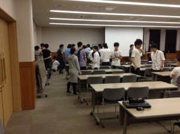
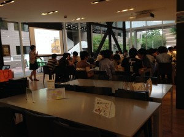

こんばんは。きゅーぶです。

 

 

先日プロジェクトのOBOG様への活動報告と交流を兼ねたOBOG会を開催しました。

 

毎年この時期に行われるOBOG会は今回で6回目を迎え今年も多くのOBOG様にご来訪頂きました。

 

ロボット紹介ではNHK大会に出場したロボットや開発中の足回りなどを説明しました。

 

今年のNHKで使った自動制御で返球するロボットは特に好評でとても褒めていただきました。

 

活動報告の後に食事会を開きレクリエーションとしてクイズ大会を行いました

OBOG様が現役の頃に作ったロボットに関するクイズを出した時は懐かしいという声がたくさん出ました。当時の事や今されていることを話し合って非常に楽しい時間を過ごしました。

 

私が今年のOBOG会係の一人として準備や進行を行ったのですが連絡の遅れや当日の度重なるミスなど多くの不手際でOBOG様に迷惑をかけてしまって本当に申し訳なかったです。

 

ロボコンは他校の人々との交流を積極的に行っていていわゆる横のつながりというものが強いですがその反面卒業された方と話し合う機会は思いのほか少なく縦のつながりが薄いという特徴があります（と僕は思っています）。

 

われらがプロジェクトも創設から長い月日が経ち今年の新入生で12代目となりまして、せっかく積み上げてきた歴史と人があるのでぜひそのつながりを絶やさず交流していけたらと思います。

 

 

それでは、今日はここで。失礼します。
