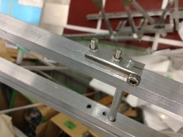
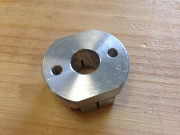
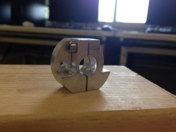
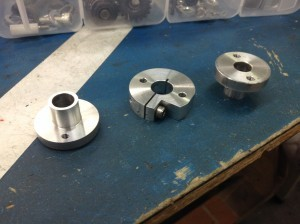

こんばんは。きゅーぶです。

 

先日から技術開発がてらいろんなものを自作できないかと試しています。

 

今回はセットカラーを自作してみました。

 

軸からベアリングが引っこ抜けないために使う丸棒の横にイモねじを切って止めるセットカラー自体は既にプロジェクト内で自作の文化があり、旋盤屋が練習としてストックを制作しています。

 

今回は１２月くらいの部内（ [http://www.fortefibre.net/blog/?p=2101](http://www.fortefibre.net/blog/?p=2101) ）で僕が作った自動機のように軸と他の物が一緒に動くタイプのセットカラーを作りました。

 

これはキャチロボ機体製作のために僕が作ったセットカラーです。

 

軸を通す穴を開けてからその横にコンターで切れ目を入れねじをきってクランピングしました。

 

最初作ったときクランピング部全部にねじきりしちゃって、これだと締めれねーじゃん！となったので片側だけボール盤で大きめの穴を開けようと思ったのですが間違って貫通・・・・・・辛かったです。

 

ブロック材さえあれば大量生産可能です。

 

そしてこちらが同期の子が作ったセットカラーです。凝り性なのでデザインに拘っています。

 

こちらは『クランピングした時、部材が曲がるので締結部分の穴位置がズレる』という問題を解決したタイプです。

 

二段にして部材と締結する部分と軸をクランピングする部分を分け、間をコンターで切れ目を入れることでクランピングしても締結段での穴間距離は変わらないので正確に締結できるようになっています。

 

既製品を買うとそこそこお値段のしちゃうものがこのように材料を買うだけで簡単に作れちゃうのです。（ロボコンに加工費はありませんしね）

 

・・・・・ただし所詮アルミでの製作品なので締結力は鉄製の既製品よりはお察し。

 

それでも十分な働きはしてくれますから激しく動かないところだとばっちり使えそうです。

 

 

フライスの練習品としてもよさそうですしこれからもごりごり作っていきたいですね。

 

 

それと、明日の7月20日（月・祝）にNHKロボコン全国大会がテレビ放送されます！

 

工芸繊維が何秒映っているかはわかりませんが見ていただけたらと思います。

朝9:30からですよ。もちろんNHKでですよ。

 

それでは、今日はここで。　失礼します。
