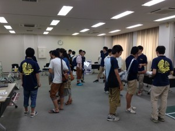
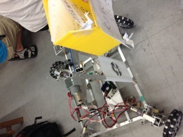
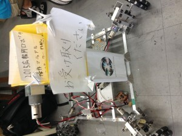

お久しぶりです。きゅーぶです。

 

テストも無事（かどうかはさておき）終わりついに夏休みですがキャチロボとか私用（免許とか）が重なりいろいろやらないといけないことがあふれ出して休みとはなんだったのか状態になっています。下手したら課題とテスト勉強でヒーヒー言ってたテスト直前より忙しいかもしれません。

へこたれずに生きたいですね。

 

さて、少し前ですが大学のオープンキャンパスが行われたのでロボコンも活動紹介をしていました。

 

パネルを使ってプロジェクトの紹介や今年のNHKロボコンに出場した機体を展示して説明したり開発中の４輪ステアの操作体験を行いました。

 

来た人にビラを配っていたのですが一日目の午前中で事前に刷ってた100枚が底をついて焦りました。たくさんの人にプロジェクトのことを知ってもらえたのではと思います。

 

我がプロジェクトは高校生にも有名みたいで来る前からプロジェクトの存在を知ってたり今年のNHKを見たという人も多くて驚きました。ロボコンに興味を持ってくれる人が多くてうれしい限りです。

 

メンバーの中にもロボコンをしたいから工芸繊維に入ったという子もいますし工繊の入学希望者増加に少なからずプロジェクトが寄与してるなーという実感を持ちましたね。いやーすごいですねー（チラッチラッ　どこのなにとは言わないですがもっとアップしてもいいんじゃないんですかねー（チラッチラッ

 

 

ちなみに今回のオープンキャンパスのためにビラ配りロボットを作ってました。

 

 

一昨年のNHK機体についてた4輪オムニをベースにビラを入れた箱を前後させる機構を付けたものです。ソフト班の一回生の子が練習として制御担当になって制御してました。

 

見学に来た人のもとへ寄っていきビラを渡すと一様に驚かれました。　もうちょっと時間があればビラを一枚一枚分けて渡す機構を作りたかったところです。来年への課題ですかね。

 

 

入学希望者の人がこのブログを見ているかは知りませんが迷ってたらぜひ工芸繊維大学に来てロボコン挑戦プロジェクトに入りいっしょにNHK優勝を目指しましょう。楽しいロボコニストライフが君を待っているぞ！！

 

・・・宣伝ってこんな感じでいいんですかね？

 

 

それでは今日はここで。失礼します。
