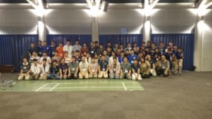

こんばんは、きゅーぶです。

 

先週から今週にかけて他大学のロボコンプロジェクト様と交流会を行っています。

 

先週は横浜国立大学様で開催された関東圏の大学が集まった関東交流会に参加させて頂き今週はうちで開催した8大学合同交流会、さらに阪大様で行われた交流会に参加しました。

 

総勢60人ものロボコニストに集まっていただきました

 

ロボコンでの交流会は毎年NHK全国大会が終わり世界大会後次のルールが発表されるまでの期間に主に行います。各大学による組織体制や取り組んでいること、今年のNHKロボコンの機体紹介を行ったあと各大学の方と話し合うレセプションがおおまかな流れです。

 

僕はキャチロボの製作がカツカツだったのでうちで開催した回の手伝いでしか参加できなかったので辛かったです。スケジュール遅れダメゼッタイ。

 

ちなみに僕は部室の設備や加工体制の説明を任されてました。拙い喋りで申し訳ございませんでした（汗）

 

他大学のロボコニスト方との交流は新発見の連続で使えなくなったと思ったものを復活させる方法などまったく思いつかなかったことを教えて頂きただただ敬服するばかりです。世の中にはすごいロボコニストがいるんだなぁ、僕も頑張ろう✊という気持ちになってプロジェクトのいい刺激になっています。

 

交流会で得た知見はプロジェクトのwikiでメンバーと共有してプロジェクトとして技術力の向上に努めたいと思います。

 

皆々様今後とも工芸繊維大学ロボコン挑戦プロジェクトをどうぞよろしくお願いいたします（土下座）

 

それでは、今日はここで。失礼します。
