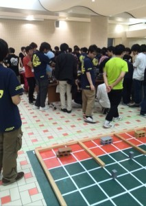
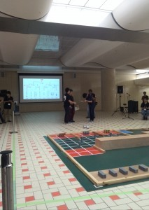
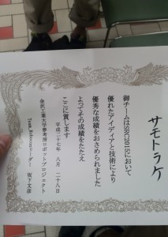

こんにちは。ふじきです。  
8/28(金)に金沢駅で開催されたSRC（Summer Robot Contest）に参加しました。   
以前にも紹介しましたが、SRCはNHK学生ロボコンで活躍を目指す新入生向けのロボットコンテストであり、去年見学した際に1回生が経験を積むためのとてもよい機会であると考え出場することを決め、1回生にチームを組んでもらい自分たちの力だけでロボットを製作することになりました。  
今年は1回生の人数が多いので全部で3チームに分けてそれぞれでロボット製作に取り組みました。 どのチームも様々な困難に見舞われながらも無事SRC当日には機体を完成させることができました。 本番では予想外のトラブルや試合前の点検ミスなどで手強い金沢チームに次々と敗れ去りましたが、3チーム中1チームが特別賞を受賞するなどまずまずの結果だったと思います。    
少なくとも自分たちが同じ1回生だった頃に比べると、この時期にこれだけのロボットを自分たちの力のみで作る機会はなかったので今回の大会は1回生にとってとてもよい経験となったと思います。  
ここで力をつけた1回生たちが今後のNHKロボコンで主力として活躍する日が楽しみです。
