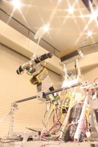

こんばんは。きゅーぶです。

 

 

広報活動として先日行われた「綾部市ものづくり体験ツアー」にて小学生にロボット紹介を行いました。

 

 

小学生を対象にものづくりに触れてもらおうという催しで、その企画の一つで我がプロジェクトが実際に作ったロボットを見学してもらいました。見てもらったのは今年のNHK全国に出た全自動機（名前：グラナイト）と開発中の４輪ステアリング、そして広報用のパラレルリンクロボットです。

グラナイトがシャトルを打ち返すと子供達が歓声を上げて喜んでくれたのでうれしい限りです。

 

今回行うにあたって最初は天井の光がシャトルの自動検出の邪魔になってしまい上手く打てなかったのですが

キネクトの上に板を被せて遮光板を付けることでシャトルを認識できるようになりました。上手くいって何より。

 

今週末にはいよいよキャチロボバトルコンテストが開催されます。僕ら二回生も死にもの狂いで機体を調整していて大変ですが頑張りたいです。

 

それでは、今日はここで。失礼します。
