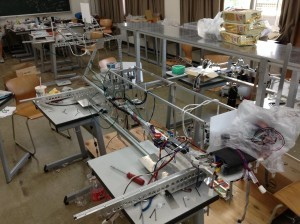
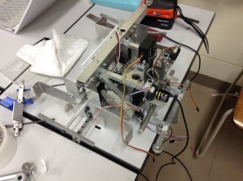
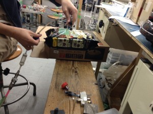
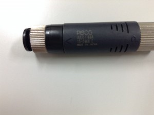

こんばんは皆さん覚えていらっしゃいますでしょうか？僕です。きゅーぶです。

 

 

**二ヶ月も自分の回の更新しなくて大変申し訳ございませんでした！！！！！（土下座）**

はい、いやほんともうこれ何言っても言い訳なのでどうしようもないんですがとりあえず更新しなかった間行方不明でも樹海にいってるわけでも高飛びでも遭難でも自分探しの旅に出ていたわけではございません。大病を患うこともなく大体おおよそ健康に生きていました。あ、体重は１ｋｇ減りました。

 

キャチロボが終わってから機体の紹介記事書かないとなーと思っていたのですが記事が長くなりまとめきれない間に新学期が始まって、実験レポートがー課題がーと授業も忙しくなっていく中NHKの設計も始まり、僕も機体設計を任されることになりましたのでスケジュールを遅らせるわけにはいかないと必死こいて設計していたら更新が滞ってこうなりました・・・・・あ、はい、長くなりそうなら先に別の記事を作っておけばよかったですほんと。

今日は忙しいし明日に・・・（フラグ）というのがn回続いてこのざまですほんと申し訳ございませんでした。説得力が皆無ですが次からは遅れないよう気をつけます。

 

 

涼しい秋から二ヶ月も空いてしまってるうちにもう寒い寒い１２月になっててどう考えても時が加速してるとしか思えません。

キャチロボに出場したうちの機体紹介を事細かくするつもりでしたが今更感が拭いきれないのも否めないの(とNHKの方が忙しくて記事が書ける見通しが立っていないの）ですいませんが写真を並べて代わりとさせて頂きたいです・・・・

 

二回生機体です。真ん中の親機部分がフィールドに落ちて下のワークを把持します。

 

この子機が自動で左右に動いて天空ゾーンのワークを把持します。設計者お気に入りの機体でぜひ動いてるところを見せたかったです・・・・

 

今回はワークの把持に真空エジェクタを採用しました。

 

写真右から供給されたエアをすき間から外に出すことで左側の空気も巻き込んだ結果左側を真空状態にできるというものです。掴めるときはがっつり掴めて非常に好印象な使い心地でした。

問題は今回のような形状が一定しないものを掴むときは吸盤を柔らかめのにしないと隙間ができてうまく掴めなかったのと、大量にエアーを消費するのでペットボトルが結構必要だったことですね。

 

二ヶ月の間に参加したイベントもあるので次以降はそれを紹介していきそうです。更新を怠らないよう再三気をつけます。

 

 

それでは,今日はここで。失礼します。
