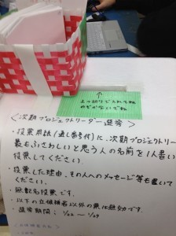

こんばんは。きゅーぶです。

 

気づけば年も明けて・・・・なんて言ってる間に1月下旬です・・・・更新が遅れてしまいすいませんでした。次からは空いた時間が無くなる前ににさっさと更新したいと思います。

 

 

 

ということで次期プロジェクトリーダー選挙です。我らがプロジェクトは今の時期に次期のリーダーを決めて2,3月に引き継ぎ、3,4月から代替わりという制度で運営しています。

決定方法は事前にリーダーを辞退したいと申し出た人を除いた総選挙制となっております。CD買おうが買わまいが一人一票ですね。期限は一週間となっており明日開票の運びとなっております。

 

そういえば去年も僕が選挙のことを記事にしたと思うのですがもうあれから一年かと思うと年が過ぎるのは早いなぁと爺くさい気持ちになってしまいます。ロボット作ってたら一年過ぎてました。早すぎて涙がでてきました。光陰矢のごとしと言いますが矢よりむしろレーザービームなんじゃないんですかねぇ。

 

 

誰が選ばれようとも頑張ってプロジェクト運営して頂きたいですね。

 

それでは、今日はここで。失礼します。
