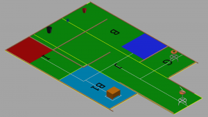
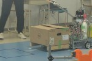
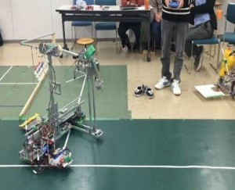
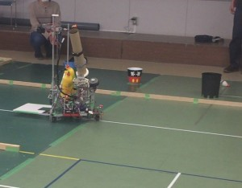
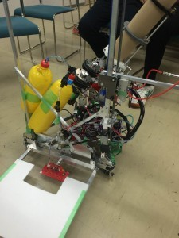

初めまして！

このたび、新しくブログ更新担当になりました、きゅうり巻きです。

自分はハード班に所属しているため、ハード関係のことについての記事を書いていこうと考えています。

 

 

さて、記念すべき最初の記事は、第三回新人戦の結果について報告します。

2つ前の記事でも触れておりましたが、新人戦自体は2月28日に行われてました。

そこから2週間以上も間が空いてしまい、申し訳ありません。しかしその分有意義な記事に出来ればな、と思います。

 

 

まず結果を報告する前に、簡単に今回の新人戦のルールを簡単に紹介します。

 

今回の新人戦のテーマは**「Clean up, Recharging the MDL」**、つまり**『部室であるMDLの清掃をロボットにさせよう！』**というものでした。

（フィールドのCAD画像です。ゴミ箱の位置等、実際のフィールドとは少し異なるところもあります。）

試合の流れとしては、ロボットが

 

①スタートゾーン（赤いエリア）からロボットが出発し、

②B1と書かれた所にある、机（を模した段ボール箱）を整理（枠の中に入れる）して、

③Gに置かれている養生テープを、Jの先にある養生入れに片付け、

④ゴミ（バドミントンのシャトル）を**全自動で**ゴミ箱に投げ入れる

（なお、ゴミ箱が置かれているエリア及びその上空は**進入禁止**）、

 

という複数の無理難題な課題をクリアしていくものでした。

また、今回は現１回生最後の新人戦ということもあり、実際の学生ロボコンとほぼ同じ制限（ロボットのサイズは１m四方に収める等）で、Aチーム、Bチーム、Cチームの３チームがそれぞれロボットを作りました。

　　

（写真は大会の様子です）

 

 

予選で各チームが２回ずつ行い、その後予選の結果を元に、トーナメント方式の決勝を行いました。

結果、全チームが少なくとも２つ以上の課題をクリアし、さらに決勝戦では２チームがVゴール（全ての課題を達成）を決め、最後までどちらのチームが優勝するかわからない、手に汗握る展開となりました！

（写真は優勝したCチームのロボットです）

 

次回は各チームのロボットの詳細およびアピールポイントについて紹介したいと思います。それでは、今日はここまで。失礼します。
