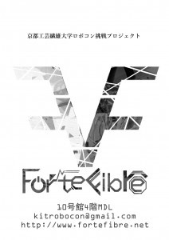

こんばんは。きゅーぶです。

 

 

僕は土日に更新する担当ですがNHKで忙しいことを理由にダダ遅れ気味でも堂々と平日更新しようと思います。

 

・・・はいすいません。土日に間に合うよう頑張ります。

 

 

もうそろそろ新入生歓迎の季節となるので今度の新歓で配る用のビラを製作しました。

 

 

デザイン力の高いメンバーに作ってもらいました。センスが尖りすぎててものすごいことになっています。秘密結社感すらしてきますね。

 

ここのＵＲＬも書いてあるので一応見に来てくれた新入生に向けてプロジェクト紹介しておきますね。

 

我ら京都工芸繊維大学ロボコン挑戦プロジェクトForteFibre（フォルテフィブレって読みます）はNHKロボコンという、ロボットを作って全国の猛者と競い合う競技での優勝を目標とし日々ロボット製作を行っています。

 

それ以外にも各種大会に出場したり広報活動として様々なイベントに参加するなど多方面に渡って活動の場を広げています。

 

ロボコンをやればこれから大学の授業で学ぶことを実際に生かすことができますし授業理解の助けにもなります。

 

ロボコンに興味がある、大学に入ってものづくりしたい！かっこいいものを作りたい！動かしたい！意欲のある人は大歓迎です！！

 

NHKロボコン全国大会常連校の実力派のうちで一緒にロボット作りをしてみませんか？

 

私たちは10号館４Ｆ階段を上って右向いて奥の緑の扉、MDLで活動しています。

 

ぜひ扉を叩いてください！お待ちしてます。

 

 

・・・と、こんな感じでいいですかね？紹介文って伝えたいことを伝えられるように書くの難しいですね。自分で実力派ってドヤ顔で書くのまぁまぁ恥ずかしいです。

 

一応言っておくとＭＤＬはカードキーで入るオートロックな扉なんでほんとにノックしてくれないと入れないので気を付けてくださいね。

 

と、こんなに書きましたが尖り過ぎてて詳しいことわかんなくなっちゃってるんで一応ビラは別のタイプも用意しそうです。

 

 

それでは今日はここで、失礼します。
