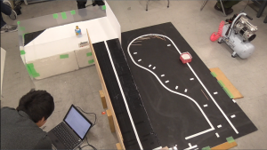
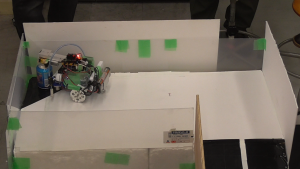

初めまして!

きゅうり巻きと共に新しくブログを担当することになった「くれろん」です。 ゆったりまったり頑張りますので、よろしくお願いします。

さて、第一回は２月２９日に部内で開かれた『レスキューロボコン』についてです。 災害地で活躍するロボットを想定した、２つのステージにまたがって５つの関門が待ち受ける大会です。 第三回新人戦に人数の関係で出場できなかった一回生ソフト班と、上回生とで機体の作成からプログラミングまでを一人で行いました。

まずはルールについて説明します。 『ロボカップジュニア 201 ロボカップジュニア 2013 レスキューA』を参考にした特別ルールです。 そして前提として、ロボットは全自動で動きます。

<コースの全体像> 

最初のステージは白線の上を走るライントレースです。コース自体は丁寧に進めば十分ですが、しかし３つの関門が邪魔をします。

まず初めの関門は、始まってすぐの所に置かれた障害物です。これは倒れた電信棒などで道が塞がれた時、それを避けて進むことを想定しています。 挑戦者は道が塞がれている事を認識し、一旦コースから離れて、再び戻ってくる必要があります。ですが一番目とはいえなかなか難度の高い障害物です。

障害物を避けたと思うと直ぐ様次の関門が迎えます。悪路を想定して、竹串がコース上に置かれています。安定性の高いライントレースか、キャタピラのような走破性の高い機体にしましょう。

そして次に、吹雪によって道が隠れたと想定して、ラインが途切れています。とはいえ直線ですので、しっかりと真っ直ぐ走ることさえ出来ればそれほど難しくありません。

ここまでくれば最初のステージは終わり、残すところ２つの関門です。。 第二ステージに行くには第四の関門となる傾斜約25°の坂道が立ちはだかります。トルクを上げて一気に通過しましょう。

坂道を登り切って第二ステージにそこには最後の関門が待ち受けています。 負傷者を発見して安全地帯まで運ぶ事を想定した、負傷者に見立てた空き缶のサーチ・アンド・レスキューです。 最後のステージにはラインが存在せず、判断基準になるのは壁か、ゴール地帯の黒く塗られた部分だけとなります。 空き缶を見つけることも難しいのですが、それを掴み、さらに安全地帯まで運ぶ。最後にして最強の関門です。 搭載された各種センサーを総動員して負傷者と安全地帯を発見し、練り込んだ機構とプログラムでゴールを目指します。

以上の関門にはそれぞれ点数が割り振られており、タイムではなく得点で勝敗を競います。(ただし、同得点ならタイムを比べる)

少人数で行ったため大会はそれほど時間もかからず終わりました。 完走できない機体も多い中、上回生の作った機体がノーミス・好タイムという他の追随を許さない強さで優勝しました。

<優勝になった機体のゴールシーン> 

私もこの大会に参加したのですが、時間不足と直前に起こったハードの故障で出場すら出来ず悔しい思いをしました。 出来た範囲内でコースを解説すると、やはり最初の障害物を探知して避けるという動きは難しかったです。マーカーは引いてあるのですが、それを使っても左右にブレてなかなかクリアが出来ませんでした。後、地味に直角カーブが厳しいですね。

改めて上回生の凄さと、一から機体を作る事で反省する点が多く見えた、有意義な大会となりました。

それではまた次回。
