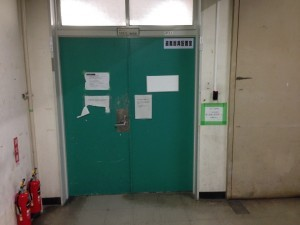

こんばんは、きゅーぶです。宣伝記事としてちょっと説明会の紹介をします。

 

きたる4/15（金）18：00からロボコン入部希望者に向けて説明会を行います。

ロボコンってなんなのやどんな活動してるの？入ったらどんな感じでロボット作っていくの・・・？ロボットのハード・ソフトって？

 

といった皆さんが気になることを説明していきたいと思うのでロボコンに興味あるけど部室に行ったことない・・・

という人はお友達も誘ってぜひ来てください。

 

場所は10号館4階MDL、階段を上って右手奥に見える緑の扉です。

 

大学でやる授業だけでは実は意外とものづくりの機会は少ないです。ロボコンではロボットをたくさん作るのでロボット作りをやってみたい！！という人はぜひお越しください。お待ちしてます！

 

ちなみに新入生への勉強会の都合もあって4/22(金)をひとまずの区切りとするつもりなので入部希望の新入生はそれまでに入部してくださいね～～。
