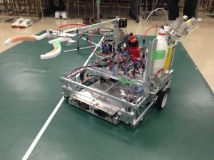
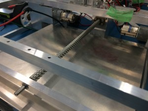
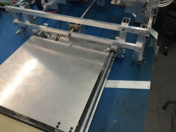
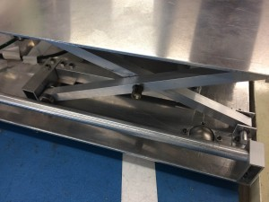
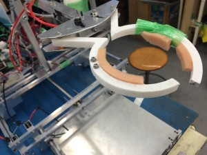
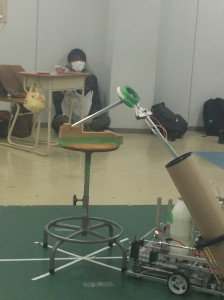
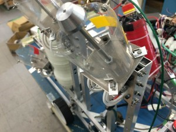
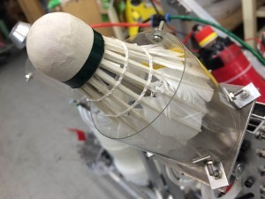

こんにちは！きゅうり巻きです。

前回、自分が書いた記事では第三回新人戦について紹介したのですが、今回の記事は各チームのロボットについて、特徴やどのように課題を解決していくのか紹介します。

 

最初はAチーム。チーム名は『**羽花繚乱**』で、ロボット名は『**工業力学Ⅲ**』です。

 

**・特徴**

２輪駆動で剛性が高く、さらに重心がかなり低いため、試合中も安定して走行していました。

 

**・机（段ボール）の運搬**

このロボットには机を持ち上げる機構が収納されており、机を持ち上げるときだけその機構を出して机を持ち上げます。

 

 

持ち上げる機構はエアシリンダを使った平行クランク機構です。

 

**・養生テープの片付け**

養生テープは長いアームでつかんで片付けます。把持部分は３Dプリンタで造形したものです。（試合中に折れたため、画像では養生テープで固定しています。）

 

 

**・ゴミ捨て（シャトル投げ）**

シャトルはエアシリンダの推力で飛ばします。また、組立後も微調整が出来るよう、高さや角度を変えられる機構も付いています。

 

 

Aチームこと羽花繚乱は、決勝戦ですべての課題をクリアし、見事Vゴールを決めました！

チームメンバーが常に協力しあい、息のあったチームでした。

 

次回は、Bチームのロボットを紹介する記事を書こうと思っています。

 

最後に、4月15日（金）の18：00から、新入生向けのロボコンの説明会がありますが、授業と重なっている新入生もいらっしゃるようなので、**16：30からも**説明会を行いますので、ものづくりに興味がある新入生は是非どちらかの時間帯に10号館4階のMDLまでお越しください！

それでは、今日はここまで。失礼します。
