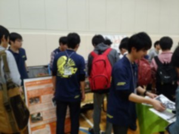
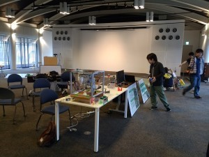
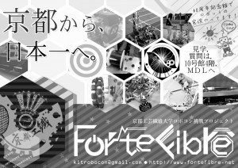
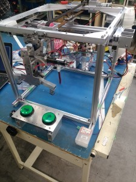
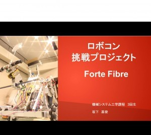

こんばんは。きゅーぶです。

 

先週は説明会あるしとりあえず宣伝しなきゃということで忙しくてそのままの感じになってしまいました。すいません。

 

4月に入ってから新入生勧誘を行っていました。

 

まず4/4に新入生の新入生歓迎オリエンテーションが行われたのですが我々は体育館と60周年記念館で活動紹介をしてました

 

体育館でのビラ配り　　　　　　　　　　　60周年記念館でのロボット操作体験（準備）

 

体育館ではパネルとともに先日から変更したNEWビラを配っていました

前回の秘密結社ﾊﾞｰｼﾞｮﾝ(と僕が勝手に呼んでるやつ)と同じ先輩作です。おしゃれ！！

60周年記念館では第三回新人戦出場機体（きゅうり巻きくんが書いてるやつです）を操作体験してもらって体育館の方ではクレーンロボットを展示してました。

クレーンゲームロボ

 

手前のボタンを押せばxyテーブルが動きハンドでフィルム入れなどをつかむというクレーンゲームとなっています。

これは今の2回生が3月に作ったもので、新入生も1年すればこんなロボットがすぐに作れるようになりますよ～と宣伝してました。

なかなかウケがよくて動くのかっこいい！と好評でした。

 

そしてこの日、新歓オリエンテーションの前に課程別オリエンテーションがあったのですがそこで機械工学課程の新入生に向けてプレゼン発表もさせて頂きました。

プレゼン表紙　映っているのは去年のNHK出場機体です。中身はNHK機体もチラ見できるので見せられませんごめんなさい

 

プレゼンなのですが、何分こういうものを作る経験があんまりなかったのものですからプレゼンが上手い先輩達に話を聞いて雛形も見せてもらいながら作りました。「ロボコン挑戦プロジェクト」の説明だったりロボットの作る流れだったり出場大会だったりを説明しながらいかにロボット作りが楽しいかというのを全力でアピールしました。

 

緊張しましたが練習してたのもあってつつがなくいきました。途中までは。事件は最後に起こります。

 

理想

僕「・・・といったことができますので皆さんもロボコンで一緒に青春しましょう！（爽やかな顔）」

新入生「あの先輩かっこいい！！」

現実

「・・・といったことができますので皆さんもロボコンで一緒にしぇい春しましょう！（やってしまったという顔）」

新入生「（あの先輩噛んだ）」

 

神のいたずらか悪魔の罠か。なんで何百回と練習して一回も噛まなかったところを本番で噛むんですかね。おかげでこの後

 

新入生「プレゼン見て見学に来たのですが・・・」

僕「お、そうなんか！ようこそロボコンへ！」

新入生「あ、噛んだ人・・・・」

僕「」

 

こんな悪魔の罠が世の中にあるなんて思いませんでした。もう2，3か月は引きずると思います。

 

と、色々ありましたが部活紹介は（僕以外）無事に終わりました。

他の日には電子システム工学課程や情報工学課程の新入生にもプレゼンしに行きました。

機械課の人にプレゼンする時はハード班寄りの情報を多くしたり電子や情報の子はソフト班寄りの情報を多く紹介したりと実は細かに工夫していました。NHK2014ビデオ審査のポールウォークを渡っているところなどロボットを動かしている動画を見せると「すげー！」と言ってくれたのが嬉しかったですね。

 

プレゼンをした後日、新入生向けにもう一度部室で説明会を行ったのですがこれが盛況で25人くらい集まってくれました。（僕がプレゼンしてたので写真はないです。誰かに頼めばよかったですね。）

入る気がないけど試しに見に来る人含めても多くて10人くらいかな～と軽く思ってたらびっくりするくらい人が来るものですからテンパってしまい部室紹介も人がごった返して若干グダってしまったのが反省点です。もっとプランを用意しとくべきでした。

 

なんやかんやあって現在既に13人も入ってくれてもう少し増えそうで嬉しい限りです。僕の学年が人少なくて苦労しているのでいいなーと思います。人数が多いといろんなことができていいですしね。

 

もう始めてる子もいますが新入生入部の一区切りは22（金）を境に勉強会を始めていきたいと思いますので入部希望の人はそれまでに来てくださいね～～～

 

それでは、今日はここで。失礼します。
