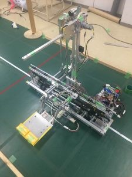
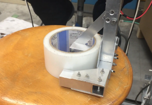
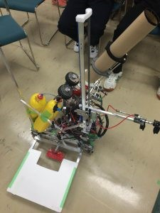
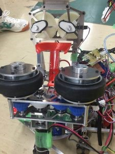

こんにちは！きゅうり巻きです。

 

前回の更新からかなり間が空いてしまいました……。僕たちが行った新人戦を紹介するはずが、気が付いたら新１回生の新人戦がもうすぐという状況になっており、かなり反省しております。

 

というわけで、今回は残りの2チームの機体を一気に紹介したいと思います。

 

まずはBチーム。チーム名は『大和和大』。

**・特徴**

全チームの中で最も大きな機体で、足回りがコの字型をしている、独特な機体です。

**・机（段ボール）の運搬**

持ち上げる部分がタイミングベルトで左右に動き、平行リンクで持ち上げる機構です。持ち上げる部分だけ動くため、微調整しやすい機構です。

**・養生テープの片付け**

（写真はハンド近影）　写真のように養生テープをつかんだ後、DCモータによってアームごと90度回転させて片付ける仕組みです。

**・ゴミ捨て（シャトル投げ）**

シャトルが入った空き缶のケースを回し、遠心力でシャトルを飛ばす機構です。

 

Bチームはエアシリンダを一切使わず、全てモータだけで制御していました。残念ながら、すべての課題を達成することは出来ませんでしたが、貴重な経験を味わえたと思います。

 

最後にCチーム。チーム名は『ヤキニク』。

**・特徴**

足回りは三輪オムニでコンパクトなロボットです。Cチームはメンバー全員がNHKに携わっており、忙しい中かなりクオリティの高いロボットを作り上げました。

 

**・机（段ボール）の運搬**

エアシリンダで持ち上げます。この際、モーメントを抑えるためにリニアガイドを用いて、安定して机を持ち上げることが出来ます。

 

**・養生テープの片付け**

3Dプリンタを用いて造形したハンドで養生テープを把持します。ラックアンドピニオンで養生テープを上下に移動させます。

 

**・ゴミ捨て（シャトル投げ）**

モータによって2つのタイヤを回転させ、その間にシャトルを入れ、シャトルを飛ばします。他のチームとは異なり、連射することが可能なため早く課題を達成することができました。

 

Cチームはすべての試合において、試合時間を_1分以上残して_Vゴールを達成し、見事**優勝**を飾りました！

 

 

今回、更新を滞らせてしまったため、BチームCチームを同時に更新することとなり、誠に申し訳ありませんでした。

 

それでは、今日はここで。失礼します。
