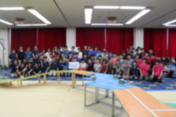

こんばんは，きゅーぶです．

 

・・・はい，忙しいのを理由に気づいたら更新が一か月飛んでました！申し訳ありませんでした！！以後気を付けます！！！！

 

気を取り直して活動報告なのですが，実は5月29日に大阪大学さん，大阪工業大学さん，立命館大学さん，三重大学さんとうちの計5大学で集まり『近畿連携練習試合』を行ってました．

 

これは何かと言うと，NHK学生ロボコンの大会本番前に近畿圏の各大学が集まり練習試合をやってみようというもので，今年が初の試みとなります．

 

規定に，大会前なので他チームの機体を撮影してはいけないなどもろもろの制約があるので準備もろもろの写真は載せれません．まぁそうですよね．

集合写真．機体は映ってないですが一応ぼかしを．

 

場所はフィールドが常設されている大阪工業大学さんのところで，同時に対戦できるように各大学でもう片面分フィールドをもちよって設営しました．常設うらやましい・・・・キョウト，セマイ．

 

立命館さんの機体が動かせなかったそうなので残りの4大学で総当たり試合を行っていました．結果も言うと怒られそうなのでご想像にお任せします．

 

本番通り時間が区切られてかつ対戦相手がいる緊張感の中行うピットやセッティング作業，そして試合は想定通りにいかないことばかりでした．自分達だけの練習ではわからなかったところがたくさん見つかって，大会までに直すことが明確にわかったので非常に有意義な試みでした．

 

気づけば大会まであともう2週間ほどです．早すぎて涙が．

悔いのないよう機体調整を行っていきます！！

 

それでは，今日はここで．失礼します．
