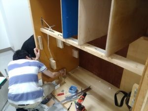
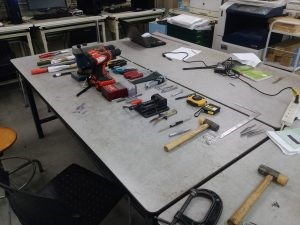
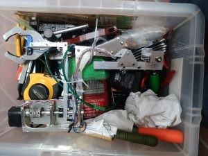
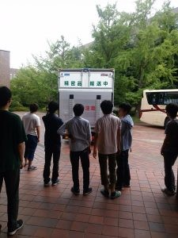

皆さんお久しぶりです，更新が遅いことで有名なきゅーぶです．

 

気づけば前回の更新が大分前で驚きです．ほんとは大会前にいつも通り『木箱運びました！大会頑張ります！』という記事を書くつもりだったのですが，今年は僕がメインメンバーだったので大会直前はバッタバタバッタバタしてしまってかけないまま当日，そして大会が終わってしまいました．その後もレポートの山が来たり成果報告の準備だなどで忙殺されて今に至ります．はい，まとめて書こうとか思わずにこの前の記事のように軽くでも書いてこまめにあげればよかったと後悔しかないのです・・・・．頑張っていきます．

 

さて，ということで，タイトルの通り7/10（日）にNHK学生ロボコン2016全国大会がありました．

結果だけ前回の更新時にお話ししてましたが今回から数回にわたって大会前からの様子や機体について順に話していきたいと思います．

 

まず大会前の木曜に機体を入れる木箱をトラックに運びいれました．

 

木箱製作の様子

 

木箱寸法は毎年大会の方から指定されているのですが，今年は昨年度と同じ制限だったので昨年度のものを流用しました．中身の配置は今年用のに変えたので二回生の子に設計して作ってもらいました．今年はハイブリッドロボットもエコロボットも例年に比べれば小さめだったので大きく分解せず入れることができたので会場での組み立ての早さにつながってよかったです．

 

荷造り

会場で使いそうなものをかたっぱしから入れました．といっても闇雲に入れてたわけではなく事前に持っていくもののリスト製作を行い，皆で確認したうえで積めました．

というのも，昨年度の大会時にはリスト製作の際，ソフト部品の項目を，機体の事をわかってる一人だけに任せてしまいその共有を行っていなかったので，すれ違いが起こっても誰も気づかずお互いが持って行ってると思ってしまって物を忘れるという事案があったのです．

その教訓から，今年は事前にあらかたあげてから他に持っていかないといけないものがないか，何個持っていくかを全員で精査したので会場では忘れ物があったということがなくよかったと思います．複数人での確認は大事ですね．当たり前でしたね．

という感じに積め込んで，ギリギリまで調整してて結局積み込むのもギリギリになってしまったのですが，無事送り出すことに成功しました．

いってらっしゃーい

 

 

こぼれ話，

新ユニフォームが届いた時，公式twitter（@kitroboconです．フォローしてくださいね）で宣伝しようという話になったのですが，なかなかいい構図が浮かばない．どうしようかとなっていたところでツイッタラーのS君がこのツイートを見つけました．（情弱なのでツイートの埋め込みとかよくわからずスクリーンショットでツイートを持ってくるダサさをいかんなく発揮しています．）

<blockquote class="twitter-tweet">

日頃からtwitterでも交流会でも懇意にさせて頂いている東京工業大学マキニスタさんの公式アカウントのツイートです．僕らと同じくチームTシャツが届いた話ですね．
</blockquote>

<blockquote class="twitter-tweet">
S君「せや！ひらめいた！」

パクツイが横行する理由がわかった気がしました．兎にも角にも無事（？）『いい構図』でユニフォーム紹介ができて一安心．

その二日後，木箱を運び入れて機体発送を終えた際ツイートをしました．

</blockquote>

その後のマキニスタ公式さんのツイート内容です，ご確認ください．

<blockquote class="twitter-tweet">

</blockquote>

してやられた！！！

仕事が早すぎる・・・ツイートから半日も経ってないのに・・・・内容から人員配置，果てはポーズまで完璧な・・・・完璧なコピー・・・・・完全に負けました．（みんななんでそんな力入れるんだ・・・）

 

という一幕があったというお話でした．マキニスタさん今後とも何卒よろしくお願いします．

 

ここから更に長くなるので会場に着いてからの話は次回にさせて頂きます．早めにしますね．

 

それでは，今回はここで，失礼します．
