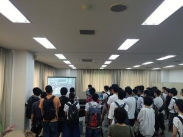

テストが明けましてお久しぶりです．きゅーぶです．

夏休みです！

 

夏休みに入ったのでＮＨＫ機体紹介の続き，と思ったのですがその前にテスト明けすぐに行ったオープンキャンパスの話を先に．

 

8/7，8に京都工芸繊維大学のオープンキャンパスがありました．うちは学生と教員の共同プロジェクトとして大学からの援助を受けていますので，活動団体としてプロジェクト紹介を見学に来てくださった方々に行っていました．

 

 

見学に来た人にプロジェクト概要と，入ってからどんなことをしていくか，どんな大会に出ているかやNHKロボコン出場機体の紹介，また新歓の時に展示したクレーンロボットの操作体験もしてました．

入って間もない（といってももう4か月ですね）一回生も自身が4か月の間にしてきたことを踏まえながら積極的に紹介をしてくれたので喜ばしかったです．

 

機械課の課程説明では，フォーミュラさんと共に学生と教員の共同プロジェクトブースに直接見学者が案内されてきますので，その時には写真のようにまとめてスライドで紹介の形にしていました．

一回約40人が午前に4回，午後に4回団体で来てそれが二日間なわけですから単純に最低でも640人！！他の課程説明を受けた後の人もたくさんいらしましたのでそれ以上，とにかく大勢の方が来たので嬉しいですがてんやわんやしながらの応対となりました．

紹介しすぎて2日目の最後には声がガラガラになってました．

 

つたない説明をしてしまいましたがロボコンがいかに楽しいかがわかってくれたら幸いです．

 

皆さんもぜひ京都工芸繊維大学に入ってロボコンにも入ってロボットをガンガン作りましょう！！！思い描いたものが作れるのはほんとに楽しいですよ！！

 

・・・・と紹介していますので更なる予算ｱｯﾌﾟを何卒何卒よろしくお願いします（ごますり）

 

それでは，今回はここで．失礼します．
