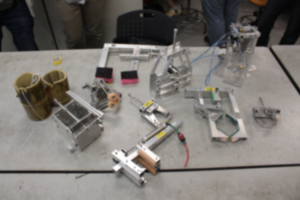
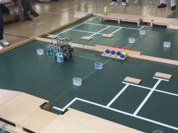
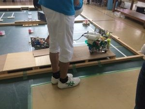

こんにちは、きゅうり巻きです！

はやくも10月に入り、後期の時間割がスタートしました。

前回の更新から半月ほど経ちましたが、その間にSRCや合同ロボコンに参加したり、小学校に訪問したり、部室が完全に移動したり……。

とにかく、色々なことがありました。

 

今回は4ヶ月ほど前に行われた第一回新人戦（更新が遅れてしまい申し訳ありません…）と、SRC2016の結果について述べたいと思います。

 

**○第一回新人戦**

今年度のハード班の新入生は、仮入部的なオリエンテーションの後、第一回新人戦としてロボットハンドの制作に取り掛かりました。ボールペンやピンポン玉、おせんべいといった物を把持し、移動させることが課題でした。

新入生はこの課題を通し、設計や加工の流れを（ハンドだけに）掴めたと思います！

（制作したハンド一覧）

 

**○SRC2016**

ロボットハンドの制作後、一回生はソフト班の一回生も交えた3チームに分かれ、金沢工業大学さん主催のSRC2016に参加しました！

（SRC2016公式HP…http://summerrc.web.fc2.com/index.html）

この大会は新入生を対象とした大会で、当プロジェクトでは去年から参加をしています。

 

（大会の様子）

 

そして今年、出場した3チームの内、1チームが見事に**3位**を飾りました！

詳しい機体紹介等は、また別の機会に行いたいです。

 

それでは、今日はここで。失礼します。
