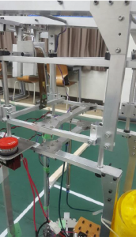
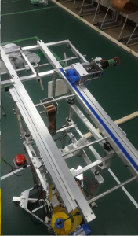
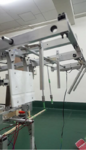

こんにちは！きゅうり巻きです。

 

11月中には更新するぞ！と思いつつ、気が付いたら前回の記事から2ヶ月も経ってしまっていました……。まことに申し訳ありません。

 

本日は９月に行われたとうロボの機体を簡単に紹介したいと思います！

 

とうロボは2回生の有志が参加した大会なのですが、参加した4人のメンバーのうち、ハードメンバーがわずか2人しかおらず、設計から加工、組み立てまでこの2人が全ておこないました！すごい！（ソフトのメンバーもロボットのシミュレーションを作る等色々すごいことをしていました！

ちなみにシミュレーションは

[https://www.youtube.com/watch?v=AShfnCs6PfE&index=3&list=PLKPScfmA8k7wOArFHaORDXCG8FQfEJQmy](https://www.youtube.com/watch?v=AShfnCs6PfE&index=3&list=PLKPScfmA8k7wOArFHaORDXCG8FQfEJQmy)　という感じです。（シミュレーション作成者の了承済み））

 

では早速、ロボットの紹介に移りたいと思います。今回のとうロボでは、さまざまな形のオブジェクトを把持し、それを別の台に置かなければならないのですが、台に置く際に高さを調節し、アームだけ前後に移動する必要があります。

（詳しいルールは[https://www.youtube.com/watch?v=XRlq3cYMGt4](https://www.youtube.com/watch?v=XRlq3cYMGt4)　を見てください）今回の記事では、これらの機構について説明しようと思います。

 

まずは上下伸縮機構から。

写真のように、エアシリンダを用いて上下に伸縮します。また、四本のリニアブッシュが上下運動をサポートし、エアシリンダに変な力が加わらないようにしています。保持力、速度ともに申し分ない機構です。

 

次に前後伸縮機構。

前後の伸縮では、ラック＆ピニオン機構を用いて、細かい調整が利くようにしています。また、２本のスライドレールを用い、スタート時にはコンパクトに、試合時には十分なストロークを得ることが出来ます。

 

最後にハンド部分。

丸棒２本をサーボモータで回転させ、様々な形のオブジェクトを把持できるようにしています。実際はなかなか球体のオブジェクトを掴むことができなかったため、輪ゴムを用いて把持力を向上させる等の工夫をしています。

 

（ちなみに、足回りには三輪オムニを用い、全方向の移動を可能にしています）

 

以上で機体の紹介を終わりにしたいと思います！

 

最後に、公式ツイッターの方では言っていたのですが、NHK2017学生ロボコンの書類審査を無事**通過**しました！現在、1次ビデオに向けて鋭意ロボット制作中です！！

 

 

次回はキャチロボの機体を紹介する予定です！

それでは、今日はここで失礼します。
