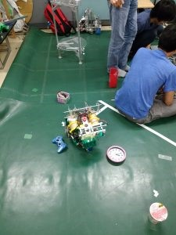
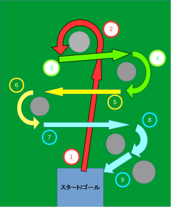
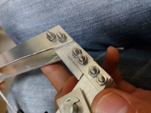
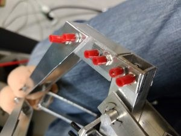

お久しぶりです.

きゅーぶです。更新がずいぶん空いてしまい,申し訳ありません．センター試験も終わり志望校を決めてる受験生も多いと思うのでロボコンのアピールを頑張っていきます．

 

さて、先日（もうだいぶ前ですが）の10/01（土）に上賀茂小学校で小学生向けの広報イベントのお手伝いに行ってました．

先生の講演でロボットとはどういうものか、どのようにして生まれたかを解説した後に，僕らが展示を行い約５０人の小学生たちに操作体験を行っていました。

先日出場したSRC機体を使ってオムニホイールの操作体験をしてもらいました．コースに障害物を置いて時間内に走行できるかを競ってもらいました．

 

コース考え中．大体僕たちがした時の1.5～２倍の時間で子供達はクリアするだろうと見積り難易度を決定します．

実際のコース．

大分難しくしたつもりでしたがいともあっさりクリアされました（汗）

 

また他にもNHK2016の機体を動かして自動制御とセンサについて解説したり，エアシリンダで動くハンドを使って木ブロックを掴んでもらう操作体験をしてもらいました．

小さな子もいるので広報イベントでは怪我のないようにするのが必須です．

ハンド部分ではボルトの先端がたくさん飛び出ていて危ないのでチューブ（エアシリンダの配管に使うのを流用）を付けることで当たっても大丈夫なようにしました．

before       ボルトがとがって危ない！                  after　安全でオシャレですね

他にも角部分には丁寧にやすりをかけたり操作する機体の速度を抑えたり・・・・・安全に遊んでもらうのが大事です．

 

小学生はとっても自由なので大変でしたが怪我もなく会は盛況でとてもよかったです．

 

それでは，今回はここで，失礼します．
