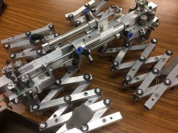
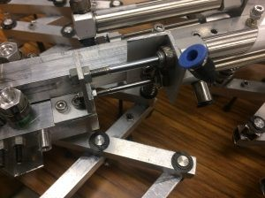
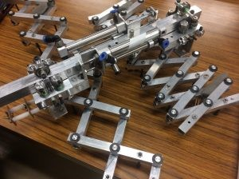

きゅうり巻きです！

 

あっという間に2017年となりましたが、2016年のタスク（機体紹介）もまだまだ残っており、非常に申し訳なく思っております。（謝ってばかりですね……）

 

さて、まず最初に、本日学生ロボコンの1次ビデオが**受理**されたとＮＨＫ様から連絡がありました！結果は2月初旬に発表されるので、無事通過することを願うばかりです。

 

次に、（今更ですが）キャチロボの機体について簡単に紹介したいと思います。

 

去年の9月に行われたキャチロボでは、当プロジェクトから出場した機体のハンドが評価され、見事審査員特別賞を受賞しました。

 

ということで、今回はそのハンドを紹介したいと思います。

上の写真がキャチロボで使われたハンドです。チーム名となっている通り、パンタグラフを用いてハンドの開閉動作を行います。

ここについているエアシリンダが前後することで、

このようにハンドが開きます！（前後別々に動作可能です！）

 

（ちなみに、キャチロボは自分が参加した大会でもありました。

自分の設計した箇所が、調整不足や重量の問題等で大会当日に没になる等色々ありましたが、振り返ってみるととても楽しい大会だったと思います。）

 

それでは、今日はここで。失礼します。
