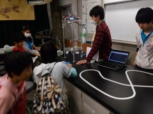
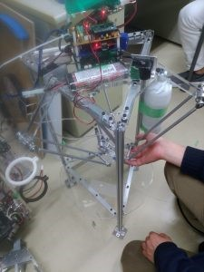
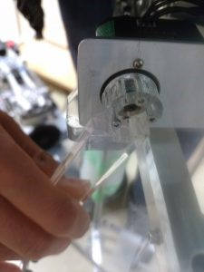
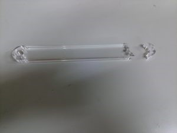
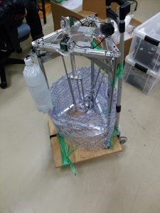

お久しぶりです，きゅーぶです．

 

更新が滞っている間に後輩君がHPのリニューアルをしてくれました．トップ画像はNHK学生ロボコン2017の競技フィールドです．競技に使うフリスビーが1枚2000円弱とお高いので他部分は（気持ち）安く作ってます．

twitter更新もトップ画面でわかるオシャレ仕様．良い仕事をしてくれます．

 

さて大分経ってしまったのですが11/12，13に京都市科学センターで青少年の科学の祭典京都大会というものが開かれたのでブース出展してました！

子供達向けに企業や学校などがブースを出展して，それぞれの場所で工作をしたり解説を行ったり・・・・と様々なことをする科学イベントです．1日で3千人弱来訪される大規模なもので，僕も小さい頃から何度も行ったり中学の部活（理科部）でブース出展したこともある京都市の科学っ子なら誰でも知ってるイベントです．

 

ロボコンでは2年ほど前から出て，未来ある小中学生にロボット紹介をしつつ工繊とロボコンへ勧誘する大事な広報活動の場であります．

 

今年は「工場で使用されてるロボットを見てみよう！」ということで工場ロボットを模擬したパラレルリンクロボットと新人戦で作ったエアハンドの操作体験，そしてライントレースの展示を行いました．

 

パラレルリンクロボットは３つのサーボモーターを動かして先端ハンドを自由な位置に移動できることが特徴のロボットです．今回はテーブル上にある商品（ペットボトル）を掴んで別の場所に移動する工程を操作体験してもらいました．

ザ・ロボットという外見とぬるぬるした動きなので子供達に大うけでした．

このパラレルリンクロボット，アーム部分やテーブル部分がアクリルをレーザー加工して作っています．通常，アクリルをのこぎりやカッターなどで切ると無数のヒビが表面にできるので断面が曇ってしまいます．しかしレーザー加工はアクリルを高温で熱して溶かすのでヒビが出来ず透き通った断面になるのです．とっても見栄えが良いので数年前から広報イベントによく持ち出しています．

しかし科学の祭典2日前，制御担当の子が調整をしてる時，事件は起こりました．

あああああああああああああああああああああああああああああああああああ！！！！！！！

 

なんと長年使い続けた疲労やら衝撃やらでアクリルハンドが根本部分で割れてしまったのです！オーマイガッ！

明日には現地に運ばねばなりません．このままでは目玉展示が展示できなくなってしまう！我々は急いでCADデータを引っ張り出しレーザー加工機のある学内工場へ駆け込みました．アクリル材料は基本使う時に使う分だけ発注をかける仕組みですが，うまい事余ってたのでなんとか作れて無事当日動かすことができました．ひやひやものです．割れやすい材料なので予備製作の重要性を感じました．

大きいので台車で運搬．割れ物ですので運ぶ時は慎重に．

 

他にもテーブルにテープを張ってライントレースをさせるなどしていました．工場ではロボットが地面のコースに沿って自動運搬するのが有名ですね．

その場でコースを張り替えてもらっても走行できるのを見せていました．

 

操作体験には列を作って子供たちが殺到しました．子供のあふれる元気にてんやわんやしながらシフトを回しましたが子供たちがおもしろいと言ってくれたのでよかったです．

来年もまた参加するつもりですので今年来れなかった人はぜひ来年来てくださいね．

 

それでは，今日はここで，失礼します．
