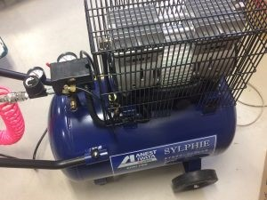
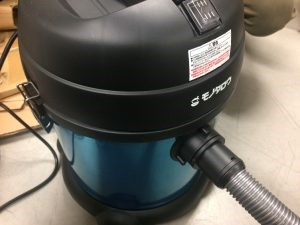

 

こんにちは！きゅうり巻きです。

あと一ヶ月したら新入生がやってくる時期になったことに驚きを隠せません。

 

さて、先日、設備投資としてエアコンプレッサや掃除機などを購入しました！

 

 

今まで使っていたエアコンプレッサは、容量が少ないために、体育館練習や大会等で空気の補充を頻繁に行わなければなりませんでした。そこで、この機会に新しくエアコンプレッサを購入しました！

 

 

かなり大きいです！これで今まで以上に効率よく進捗を生むことができそうです！！

 

 

また、部室にある掃除機も、長年使っていたために掃除機のホースの部分がちぎれてしまいました。養生テープでの補強も限界を感じたため、新しく掃除機を購入しました！

 

綺麗です！これで掃除もスムーズに行えそうです！！

 

この他にも、新たにエンドミルや圧着工具など、今まで無くて困っていたものを買いました。これで今まで以上に効率よく作業を行うことができそうです！

 

 

それでは、今日はここで。失礼します。
