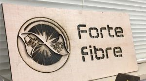

はじめまして、新しくブログ係になった新2回生ソフト班のハンスです。

さて、今回は新入生のための記事になります。

  
  

新入生の皆さん、合格おめでとうございます！明日はいよいよ入学式ですね。

  
  

京都工芸繊維大学は理系大学ですから新入生の中には将来ものづくりに関わりたい！と思って入学してきた人も少なくないと思います。実際、これを書いている私もその一人でした。しかし、大学の授業でせっかく習ったことを生かせる機会やものづくり実践の機会は限られています。もし、あなたがロボット作りを通してものづくりの喜びを知りたい、授業で習ったことを実際に役立てたい、と思うならぜひロボコンへ！やる気のある人は大歓迎です。

  
  

自分の技術・実力不足を心配している人も大丈夫！今の部員は全員初心者からスタートしており、新入生には先輩がやさしくサポートしてくれます。

  
  

ロボコンに少しでも入部したいと思った人は4/14（金）、4/17(月)のそれぞれ18時から西実験棟2階3号室（WL23）にて新入生対象の説明会を行いますのでぜひお越し下さい。

それ以前でも西実験棟2階の部室（WL23と同じ階です）に来てくれた人は部室見学及び入部手続きが可能です。写真のような看板があるので目印に来てください！

  
  

ロボコンに入部してくれた新入生にはまずハード班、ソフト班のいずれかを選んでもらいます。

ハード班はロボットの設計・加工・組み立てを担当し、ソフト班はロボットを動かすための回路の設計・製作、ロボットの制御を担当します。

もちろん、いきなり難しい事はできないので簡単な機構製作、制御から始めていってだんだん複雑で大きなロボットに触れるようになります！

  
  

最後に、ロボコン挑戦プロジェクトとは『学生と教員の共同プロジェクト』ですので通常のサークルや部活より予算が多く頂いてます。

なのでメインのNHK学生ロボコンはもちろんその他の大会に出場したり、地域のイベントに参加して大学の広報活動を行うなど幅広い活動を行っている大規模なプロジェクトです。興味のある人はぜひ来てください！

  
  

P.S.

因みに近いうちにホームページがリニューアルされるそうです。楽しみですね。
