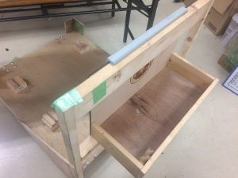
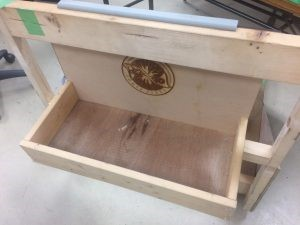

こんにちは，きゅうり巻きです！

 

気が付いたら6月に入り，ＮＨＫ学生ロボコン本番まで残り１０日となってしまいました．「光陰矢の如し」とはまさにこのことだと痛感しております．

 

さて，本日のブログなのですが，ＮＨＫ学生ロボコンに出場するロボットの写真

 

……ではなく，そのロボットを運ぶ台車について紹介しようと思います．

ロボットは例年，体育館等で練習する時には部室から数人がかりで運んでおりました．しかし，部室から体育館まではそこそこの距離があり，ロボットを運び終えた部員たちはいつも腰を痛めていました．

そこで今年はロボットを運ぶ台車を製作しました！

ロゴ入りです！かっこいい！（台車の設計者から，ブログの掲載許可はとってあります）

これでロボットの運搬が非常に楽になりました！！

（ちなみに写真は４月に撮ったものです．撮影日から少しラグがあるように見えますが気のせいです．）

 

大会に向けて，現在最後の調整中ですので，これからもどうぞ応援のほどよろしくお願いいたします！
