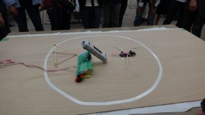
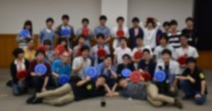

おはようございます、ハンスです。

去る７月１日土曜日にOBOG会がありました。 今年のOB・OG会には全部で15名のOB・OG様にご参加いただきました。 この日のためにわざわざ京都まで駆けつけて下さったりなど、お忙しい中をわざわざ来てくださったOB・OG様、ありがとうございました。

まず、NHK2017大会出場ロボットによるテストランにおけるパラメータ合わせ実演や一連動作を行いました。 テストランは本番と同じ5分間の制限時間のもと本番と同じ動きで行ったり、一連動作では１分１０秒台で「APPARE!」を決めるなど普段通りの練習を見せることができました。

一連動作の後、NHK機体 vs OB・OG様の対戦を試合形式で行いました。 OB・OG様方もここぞとばかりに子供心を取り戻してはしゃいでおられ、とても楽しい時間になりました。 （現役はディスク拾いをしましたが投げられるディスクの数が尋常ではなくとても疲れました（笑）） https://youtu.be/B3MYUMJO-1A

この後、機体を囲んで大会後の技術交流会のような形で機体解説を行いました。 皆さん興味津々に見入っておられ、質問が飛び交いました。

次に別室に移り、旧・新プロジェクトリーダーが昨年度の成果報告や今年度の運営計画のプレゼンを行いました。 社会人の視点や時には元ロボコニストの視点から厳しく鋭いアドバイスをいただきましたが、是非これからのプロジェクト運営の参考にしていきたいと思います。

その後、ヘボコンと呼ばれる即席ロボコン（？）を行いました。 動力源が輪ゴムだけだった昨年度からパワーアップしてモーター＆ギアボックスが使用可能になりました！ 

ヘボコンが終わった後は食堂オルタスに注文しておいた料理で食事会！ おかわりを何回もしてひたすら食べる部員もいれば食事はそこそこにロボットに見入ったり話に花を咲かせるOBOGの姿もありました。 特にNHK学生ロボコン2014でデザイン賞と特別賞をダブル受賞した機体をテレビで見て憧れて入部したロボコン少年と当時の設計者の出会いは熱かったです。

そうこうしている間にあっという間にお別れの時間が来てしまいましたが、自分もOBになったら是非来たい！と思えるようなOB・OG会でした（気が早い笑）

最後の集合写真です。（プライバシーの観点からぼかしを入れています。雰囲気を感じ取ってください笑） 
